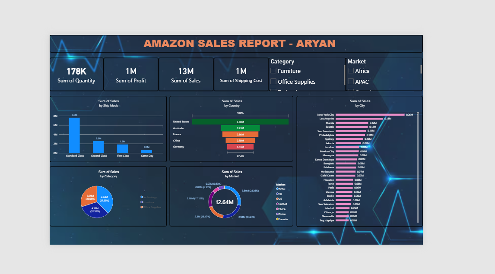

# Amazon Sales Dashboard — Power BI

An interactive Power BI dashboard analyzing global e-commerce sales performance across 51,000+ orders.

## 📊 Overview

This project turns a multi-sheet raw sales dataset into a single-page executive dashboard, covering sales, profit, quantity, and shipping cost broken down by ship mode, country, city, category, and market.

**Key metrics visualized:**
- 178K units sold
- 13M in total sales
- 1M in profit
- 1M in shipping cost
- 51,291 orders across dozens of countries and global markets (APAC, US, EU, LATAM, EMEA, Africa, Canada)

## 🗂️ Data

Source data (`ECOMM_DATA.xlsx`) contains three sheets:
| Sheet | Rows | Description |
|---|---|---|
| Orders | 51,291 | Order-level transaction data (date, ship mode, customer, product, sales, profit, etc.) |
| Returns | 2,174 | Returned order flags by market |
| People | 1,000 | Regional account/segment mapping |

## 🛠️ Built With

- **Power BI Desktop** — data modeling (Power Query) and report design
- **DAX** — calculated measures for KPIs
- **Excel** — source data cleanup

## 📁 Repo Contents

- `Amazon_Sales_Dashboard.pbix` — the Power BI report file
- `ECOMM_DATA.xlsx` — source dataset
- `screenshot.png` — dashboard preview
- `README.md` — this file

## 📈 Visuals Included

1. KPI cards — Quantity, Profit, Sales, Shipping Cost
2. Sales by Ship Mode (bar chart)
3. Sales by Country (funnel)
4. Sales by City (horizontal bar, top cities)
5. Sales by Category (pie chart)
6. Sales by Market (donut chart)
7. Slicers — Category and Market filters

## 🖼️ Preview

## 👤 Author

**Aryan** — [LinkedIn](https://www.linkedin.com/in/aryan-saini-97b144218?) · [GitHub](https://github.com/Aryan0588)
